<!-- 
  ========================================================================
                      CYBERPUNK CODER PROFILE README
  ========================================================================
  INSTRUCTIONS:
  1. This profile works completely out-of-the-box using the custom animated
     assets located in the `assets/` folder.
  2. Customize your bio, stack, and links below.
  3. If you want to swap the static stats panels for live GitHub API stats,
     refer to the comments in the "GITHUB_STATS" section.
  ========================================================================
-->

<div align="center">
  <!-- Custom animated terminal banner -->
  
</div>

<br />

<div align="center">
  <!-- Glowing/Cyber badges using shields.io customized colors -->
  
  
  
</div>

---

<table width="100%" border="0" cellpadding="0" cellspacing="0">
  <tr>
    <!-- Main About Section -->
    <td width="55%" valign="top" style="border: none; padding-right: 20px;">
      <h2>🚀 SYSTEM_INIT.sh</h2>
      <p>
        Welcome, visitor! I'm a developer specializing in building modern web architectures, crafting interactive user interfaces, and automating workflows.
      </p>
      <p>
        I enjoy turning complex problems into elegant, maintainable code. Whether it's optimization, developer tooling, or front-end animations, I like pushing the boundaries of what is possible in the browser.
      </p>
      <ul>
        <li>🔭 I’m currently working on high-performance web applications and backend microservices</li>
        <li>🌱 I’m learning the internals of Large Language Models and AI automation tools</li>
        <li>💬 Ask me about building clean components or optimizing automation scripts</li>
        <li>⚡ Fun fact: Code compiles faster when listened to with Synthwave at 120BPM</li>
      </ul>
    </td>
    <!-- Status HUD Card Widget -->
    <td width="45%" valign="top" align="center" style="border: none;">
      <br />
      
    </td>
  </tr>
</table>

---

## 🛠️ TECH_STACK

<div align="left">
  <h3>💻 Languages &amp; Core</h3>
  
  
  
  
  
  <br /><br />
  
  <h3>🚀 Frameworks &amp; Libraries</h3>
  
  
  
  
  <br /><br />

  <h3>🔧 Tools &amp; Infrastructure</h3>
  
  
  
  
</div>

---

## 📊 GITHUB_STATS

<!-- 
  NOTE: This section uses custom local animated dashboard graphics. 
  If you'd rather load dynamic live-updating stats cards from your real-time GitHub data, 
  uncomment the lines below and replace 'YOUR_GITHUB_USERNAME' with your actual username.
-->

<div align="center">
  <table border="0" cellpadding="0" cellspacing="0" width="100%">
    <tr>
      <!-- Custom Local Animated Stats Panel -->
      <td width="50%" align="center" style="border: none;">
        
      </td>
      <!-- Custom Local Animated Languages Panel -->
      <td width="50%" align="center" style="border: none;">
        
      </td>
    </tr>
  </table>

  <!-- Live Dynamic Stats Alternate Code (Uncomment to use):
  <table border="0" cellpadding="0" cellspacing="0" width="100%">
    <tr>
      <td width="50%" align="center" style="border: none;">
        
      </td>
      <td width="50%" align="center" style="border: none;">
        
      </td>
    </tr>
  </table>
  <br />
  
  -->
</div>

---

## 📬 TERMINAL_PROMPT

```bash
badhr@github:~$ mailto hello@badhr.dev --subject="Hello from GitHub!"
```

<div align="center">
  <sub>Designed with ⚡ by <a href="https://github.com/badhr">badhr</a></sub>
</div>
